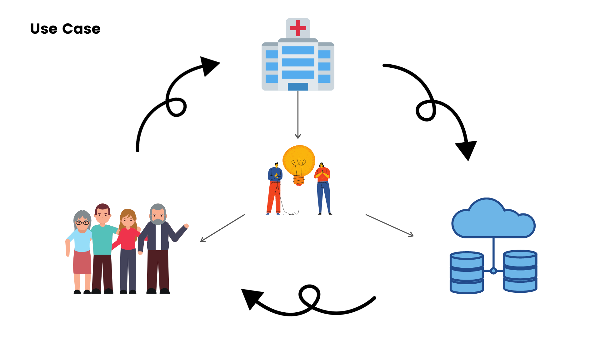
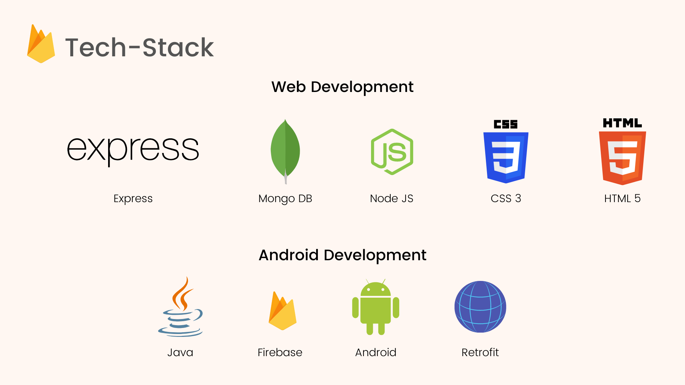

# NIROG

<p align="center">
  
</p>

Though India's healthcare is one of the fastest growing in the world, the lack of proper management is a major concern for the country's tremendous population. Apart from accessibility, awareness is another deterrent to addressing health issues, both in terms of timely and quality care. By providing all the neccessary informations digitally to everyone, we can avoid the complications to much extent. Our service is providing with one android application for the users and a web portal for the hospitals. The details are as follows:

# Android Application

Our application is basically a platform where the users will be able to see all the hospitals in their nearby locality. Further they can seek appointments from respective doctors. The users will also get to know all the further services available in that particular hospital, for example the new departments introduced, the new services available, and most importantly informations about the vaccines their kids need to take.

# WEB PORTAL

This is made specifically for the hospital authority.
Whenever a particular hospital will register after verification, they can successfully use the portal, where they can customise there information on daily basis and
update it, for
example :

- New vaccine that are available at present.
- Doctors available at present and all the lastest information along with this.

## TARGET

At present, our application mainly focuses on the new borns and the hospital authority -

- As with the help of our application, the parents of any new born can register and get all the detailed informations on what are the vaccine that should be given to the child along with all the neccessary details.
- The hospital authority can register in our application and update all the details daily , through which all the common people will get to know regarding their services and can avail them.

## USE CASE

<p align="center">
  
</p>

With the help of our application we are trying to creat an `ecosystem` which will connect all the common people (both rural and urdan) and the medical authority (both private and government as well).

## PROJECT STRUCTURE

In the main repository we have two directories: `android_app` and `web_portal`.
`android_app` contains the code of the android application and `web_portal` contains
the code of the web portal which will be used by the hospitals

The structure of the `web_portal` is:

```
├── app.js
├── controllers
│   ├── authController.js
│   └── doctorController.js
|   └── hospitalController.js
|   └── userController.js
|   └── vaccineController.js

├── .env
├── .env.example
├── .gitignore
└── models
│    ├── authRoutes.js
|    └── forumPostCommentModel.js
|    └── forumPostModel.js
|    └── orgModel.js
|    └── postModel.js
|    └── projectModel.js
|    └── storyModel.js
|    └── userModel.js

├── package.json
├── package-lock.json
├── README.md
├── routes
│   ├── authRoutes.js
│   └── doctorRoutes.js
│   └── hospitalRoutes.js
│   └── userRoutes.js
│   └── vaccineRoutes.js
│   └── viewRoutes.js

├── views
    └── portal
│       ├── addDoctor.ejs
│       └── addVaccine.ejs
│       └── dashboard.ejs
│       └── homepage.ejs
│       └── login.ejs
│       └── signup.ejs
|       └── updateBio.ejs
|       └── updateContact.ejs
├── server.js

```

## How to run the web portal locally?

Make sure that [Node JS](https://nodejs.org/en/) is installed in the system.

1. Clone the repository and go to the web_portal directory using `cd web_portal`
2. Create a .env file and add the environment variables mentioned in .env.example
3. Use the following command to run the app locally

```console
npm install
npm start
```

The web_portal now can be accessed at `localhost:8080`

Currently the web portal is deployed in [Heroku](https://heroku.com)
The web portal can be accessed [here](http://nirog.herokuapp.com/)

#

The structure of the `android_app` is:

```
├── app
    └── src
        └── main
            └── AppPreferences
            |    └── Preferences.java
            |    └── SharedPrefsHelper.java
            └── Authentication
            |    └── ForgetPasswordFragment.java
            |    └── LoginFragment.java
            |    └── SignupFragment.java
            |    └── VerifyEmailFragment.java
            └── ChildDetailsForm
            |    └── childAccountFragment.java
            |    └── childDetailsFormFragment.java
            └── data
            |    └── Api
            |    |    └── ApiHelper.java
            |    |    └── ApiService.java
            |    └── Model
            |    |    └── CovidTracker
            |    |    |    └── CovidResponse.java
            |    |    └── BabyDetails.java
            |    |    └── Guidelines.java
            |    |    └── RegisterBaby.java
            |    |    └── ResponseBabyDetails.java
            |    |    └── ResponseHospital.java
            |    |    └── ResponseSignup.java
            |    |    └── ResponseVaccine.java
            |    |    └── Signup.java
            |    |    └── UserDetails.java
            └── MainDestinations
            |    └── Guide
            |    |    └── GuideFragment.java
            |    |    └── ViewPager.java
            |    └── Hospital
            |    |    └── Doctor
            |    |    |    └── DoctorDetailFragment.java
            |    |    └── DoctorListAdapter.java
            |    |    └── HospitalDetailsFragment.java
            |    |    └── HospitalFragment.java
            |    |    └── HospitalListAdapter.java
            |    |    └── VacDetailsAdapter.java
            |    └── Settings
            |    |    └── SettingFragment.java
            |    └── Vaccine
            |    |    └── HistoryListAdapter.java
            |    |    └── VaccineDetailsFragment.java
            |    |    └── VaccineFragment.java
            |    |    └── VaccineListAdapter.java
            |    |    └── VaccineListFragment.java
            |    |    └── ViewPagerAdapter.java
            |    └── BottomNavFragment.java
            └── retrofit
            |    └── RetrofitProvider.java
            └── SplashFragment
            |    └── SplashFragment.java
            └── viewModel
            |    └── BabyViewModel.java
            |    └── HospitalViewModel.java
            |    └── SharedViewModel.java
            |    └── VaccineViewModel.java
            └── DummyFragment.java
            └── MainActivity.java


```

## How to run the android app on Android Studio ?

Steps to run the android app :

1.  Clone the [Repository](https://github.com/JyotimoyKashyap/SolutionChallenge2021)
2.  Now launch Android Studio
3.  Select the import project option from the file tab (or) select "Open an existing project".
4.  Now, locate the repo and then inside the repo, locate the android_app directory and then open the `android_app` directory in Android Stduio.
5.  Wait for sometime for the build to finish successfully.
6.  After successful gradle build, from the top options panel, click on run button (or) play button to run the app on real device or on an emulator.

## Tech Stack

<p align="center">
  
</p>

## Conclusion

As we know there are many people out there, those who dont know regarding the lastest medical facilities given by our government and the guidelines or measures to be
followed to stay fit and healthy. With the help of this application we are trying to bridge the gap between the hospitals and the common people and make the common
peoples aware.
